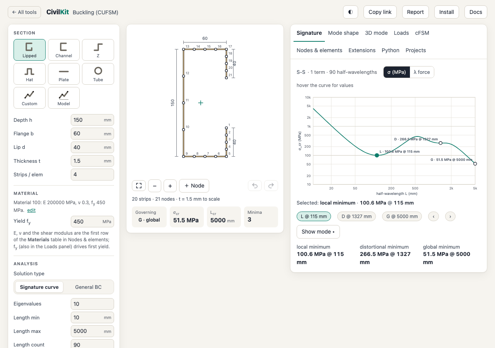

# CivilKit Buckling

CivilKit Buckling is part of [CivilKit](https://mageengineering.com.au), open structural
engineering tools by Mage Engineering.

**[Open the app](https://mageengineering.com.au/apps/buckling/)** · sister projects:
[cufsm-rs](https://github.com/mageaustralia/cufsm-rs) (the Rust engine) and
[cufsm-rs-py](https://github.com/mageaustralia/cufsm-rs-py) (the same engine in Python,
`pip install cufsm-rs-py`)

Elastic buckling of thin-walled members, in the browser. Draw or pick a cold-formed section, and
get the signature curve, its minima and the buckling modes in 2D and 3D, with no install and no
server: the finite strip method runs in the page, compiled to WebAssembly.



## Built on CUFSM

CivilKit Buckling stands on [CUFSM](https://www.ce.jhu.edu/cufsm/)
([source](https://github.com/thinwalled/cufsm-git)), the finite strip software by
**Benjamin W. Schafer** and co-workers at Johns Hopkins University, with **Sándor Ádány** for the
constrained finite strip method. CUFSM has taught a generation of engineers how thin-walled members
buckle, and its authors made it free and open. Thank you.

The analysis engine is [cufsm-rs](https://github.com/mageaustralia/cufsm-rs), a Rust port of
CUFSM, checked against CUFSM's own results to 1e-12. [pyCUFSM](https://github.com/ClearCalcs/pyCUFSM),
the earlier pure-Python port, is prior work this project gratefully acknowledges.

cufsm-rs and this app are an independent port, not affiliated with or endorsed by the CUFSM
authors. To publish results, cite CUFSM as its authors ask (the
[Python API page of the guide](https://mageengineering.com.au/apps/buckling/guide/python-api.html) gives the citations).

## Features

- **Finite strip method (FSM).** The signature curve and its minima, and mode shapes in 2D and 3D,
  for lipped channels, channels, Z sections, hats, plates and custom sections. CUFSM's five end
  conditions, springs and equation constraints.
- **Constrained FSM (cFSM).** The global, distortional, local and other (G, D, L, O) curves, and
  the classification of each minimum.
- **Tubes (FTM).** The finite tube method of Ádány and Schafer (Thin-Walled Structures 206, 2025)
  for circular tubes, under any mix of compression, bending, torque and shear.
- **Loads and first yield.** CUFSM's reference loads (P, Mxx, Mzz, M11, M22 and B), Generate from
  stress, and the first-yield actions at f<sub>y</sub>.
- **Report, share links and projects.** A print-ready report of the analysis; a link that reopens
  the same analysis; projects saved on the device.
- **Phones and tablets.** A touch layout with a section editor for fingers, 48 px targets and
  screen-reader support, checked with axe-core on every view.
- **Offline.** An installable app: once loaded, the analysis, your projects and the extensions work
  with no connection.
- **Extensions.** Small apps in Python (`.ckext` files) that run in a sandbox inside the app, with a
  form, results, charts and a Verified badge from worked examples. Three reference modules ship in
  the store, and a builder in the app writes and tests new ones.
- **The Python console.** Your own scripts, written for `cufsm-rs-py`, run in the page with the
  same numbers as on your machine: on MicroPython at once, or on full Python (Pyodide, with numpy,
  scipy and matplotlib) when you agree to its download.

The [guide](https://mageengineering.com.au/apps/buckling/guide/) covers extensions and the console in
full; its source is in [`guide/`](guide/).

## Running it locally

The page is static files: ES modules, no bundler and no framework. It fetches its modules and the
engine, so serve the folder over http (opening `index.html` as a file does not work):

```sh
git clone https://github.com/mageaustralia/civilkit-buckling.git
cd civilkit-buckling
python3 -m http.server 8765        # then open http://localhost:8765/
```

Edit a file and reload. If the browser shows an old file, hard-reload (Cmd+Shift+R or
Ctrl+Shift+R). On localhost the service worker registers only with `?sw=1`, so a reload always
shows your edit.

**Full Python in the console.** The console runs on MicroPython out of the box. For full Python
(numpy, scipy, matplotlib), fetch the pinned Pyodide release into `vendor/pyodide/` (about
40 MB, git ignores it; every file is checked against its SHA-256):

```sh
npm run pyodide
```

## Tests

You need Node 20 or later (developed on 22).

```sh
npm ci                                                     # test dependencies
npm run pyodide                                            # once: two suites run full Python
npm test                                                   # unit tests, node --test
```

`npm test` covers the engine wrapper against the real `cufsm.wasm`, the model, share links,
projects, the extension runtime and its sandbox, the Python console's runtimes (checked against
CPython results stored in `tests/fixtures/pyparity/`), the guide's links and references, and the
service worker's file list. Without `vendor/pyodide/`, the full-Python suites
(`tests/py-pyodide.test.mjs`, `tests/parity/`) fail and say to run `npm run pyodide`.

The browser suites drive the page in headless Chromium (`npx playwright install chromium` once).
Serve the folder, then pass its URL:

```sh
python3 -m http.server 8765 &
BASE_URL='http://localhost:8765/?test=1' npm run smoke     # the main flows, a few seconds
BASE_URL='http://localhost:8765/' npm run mobile           # phones and tablets, real touch input
BASE_URL='http://localhost:8765/' npm run a11y             # axe-core on every view, and what axe cannot check
BASE_URL='http://localhost:8765/' npm run console          # the Python console (full Python needs npm run pyodide)
npm run offline                                            # serves itself: the installable offline app
```

`tests/fixtures/video-c.json` is the 10-node C section from the CUFSM tutorial video; its
first-yield actions are an acceptance check against current CUFSM.

## Rebuilding the engine

The committed `cufsm.wasm` is prebuilt (cufsm-rs 0.4.2), so you only need Rust to change the
engine: Rust stable with `rustup target add wasm32-unknown-unknown`, and a cufsm-rs checkout.

```sh
git clone https://github.com/mageaustralia/cufsm-rs.git ../cufsm-rs
node build-wasm.mjs                # uses ../cufsm-rs; or: node build-wasm.mjs path/to/cufsm-rs
npm test
```

The script builds cufsm-rs with its `ffi` feature, copies the result here as `cufsm.wasm`, checks
every export the page calls and the C interface's ABI version, and warns if the file is over its
600 KB budget. Rebuilding from the pinned cufsm-rs commit gives the same bytes. After changing any
file the page loads, run `npm run precache` to regenerate the service worker (`sw.js`); `npm test`
fails while it is stale.

## Project layout

| Path | What it is |
|---|---|
| `index.html`, `styles.css`, `styles/` | The page and its styles. The printable report copies them. |
| `app.js` | The page's code: an ES module that imports the modules in `js/`. |
| `js/engine.js` | The cufsm-rs engine behind plain functions: loads `cufsm.wasm`, checks the ABI and marshals the model. Runs in the browser, a worker and Node. |
| `js/model.js`, `js/lengths.js`, `js/shapes.js` | The CUFSM model as plain data, the length list, and the section templates. |
| `js/share.js`, `js/projects.js` | Share links (the whole analysis in the URL) and projects on the device. |
| `js/ext/` | Extensions: the sandboxed MicroPython worker, the capabilities the host offers, the manager and the builder. |
| `js/py/`, `py/` | The Python console: its runtimes (MicroPython and Pyodide), the `cufsm_rs` lite package and the example scripts. |
| `py/cufsm-rs-py/` | The cufsm-rs-py package's own Python files, unchanged, for full Python. |
| `extensions/`, `store/` | The three reference modules, as source folders and as the store's `.ckext` files. |
| `guide/` | The guide to extensions and the Python console. |
| `vendor/civilkit/` | The extension runtime shared with CivilKit Studio, MicroPython and fflate (see its README). |
| `cufsm.wasm`, `build-wasm.mjs` | The engine and the script that builds it. |
| `sw.js`, `manifest.webmanifest`, `icons/` | The offline app: the generated service worker, the web app manifest and its icons (rendered from `icons/icon.svg` and `icons/maskable.svg` with `rsvg-convert -w <size>`: 192, 512, maskable 512, apple-touch 180). |
| `tools/` | The `ckext` command line, the precache and Pyodide tools, and the vendoring scripts. |
| `tests/` | Unit tests, the browser suites and their fixtures. |
| `docs/maintainers.md` | Hosting a copy, releasing, and re-vendoring. |

## Contributing

Issues and pull requests are welcome: bug reports with a share link or a CUFSM file that shows
the problem are the most useful thing you can send.

- Keep the page buildless: plain ES modules, no new runtime dependencies.
- Numbers come from the engine. A change that alters a result needs a test that pins it, ideally
  against CUFSM or a published example.
- Run `npm test`, and the browser suite your change touches, before you open a pull request. If
  you change a file the page loads, run `npm run precache` and commit `sw.js` too.
- Phones are first-class: check a change at 390 px wide as well as on a desktop, in light and
  dark.

Extensions are the easiest way to add something without touching the app: see the
[tutorial](https://mageengineering.com.au/apps/buckling/guide/tutorial.html). Contributions are accepted under the Apache License 2.0 (its
section 5).

## Licence

CivilKit Buckling is licensed under the [Apache License 2.0](LICENSE); see [NOTICE](NOTICE). It
includes third-party software under its own licences, listed in
[THIRD_PARTY_NOTICES](THIRD_PARTY_NOTICES): cufsm-rs and CUFSM (MIT), cufsm-rs-py (MIT),
MicroPython (MIT) and fflate (MIT), and, downloaded on request, Pyodide (MPL-2.0) with numpy,
scipy and matplotlib.

The names "CivilKit" and "CivilKit Buckling" and the CivilKit logo are not covered by the code's
licence: a fork or hosted copy uses its own name and may say it is based on CivilKit Buckling.
See [TRADEMARKS.md](TRADEMARKS.md).

An analysis tool, not a design certificate: the engineer of record checks what they use.
